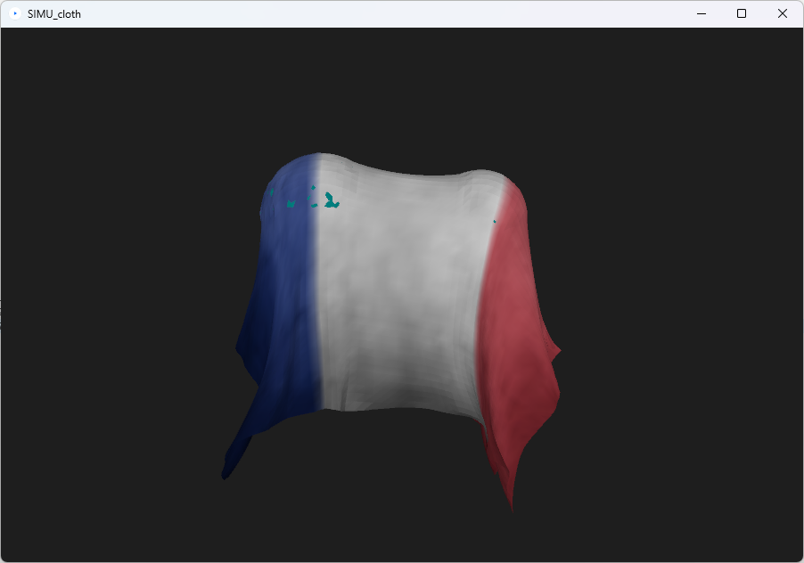
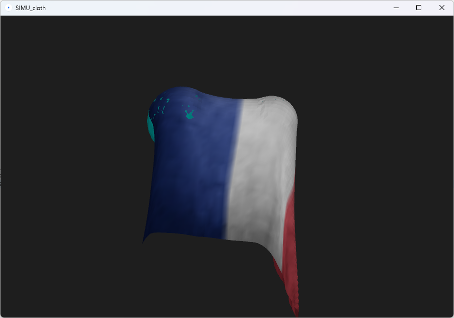
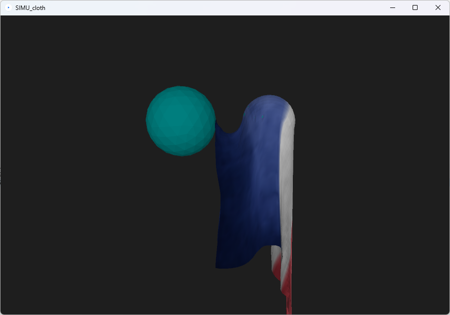
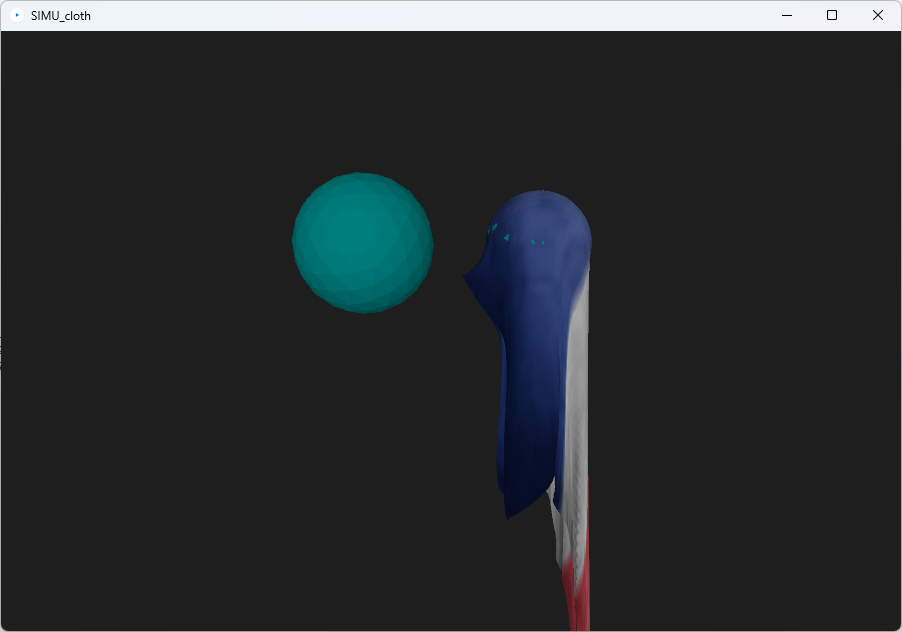

# SIMU_cloth
 
## Présentation

Dans ce répertoire, vous trouverez un code réalisé en binôme durant ma première année du master ISICG. L'objectif du projet était de proposer une implémentation temps réél sur processing se raprochant le plus possible des travaux proposés dans un papier de recherche de notre choix traitant de la simulation.

Nous avons choisi de travailler sur l'un des SIGGRAPH de 2018, [An Implicit Frictional Contact Solver for Adaptive Cloth Simulation](https://www-users.cselabs.umn.edu/~lixx4611/files/clothNodalContactSolver.pdf).

Notre objectif était alors de coder un modèle de tissu stable permetant la prise en compte des collisions avec les objets de la scène. Il faudra ensuite que notre modèle apporte une réponse adéquate à ces collisions permettant au tissu de glisser ou de s'accrocher à la surface.

## Résultats

Sur notre scène de test nous faisons tomber notre tissu sur deux sphères où l'une est légèrement plus petite que l'autre. On peut alors observer dans un premier temps que la chute du drap est stoppée par les sphères. Ensuite en raison de la gravité et de l'inclinaison du tissu, ce dernier va se mettre à glisser de la plus grande sphère jusqu'à n'être retenu que par la petite sphère. Et par la suite il va glisser de cette petite sphère et se remettre à tomber.

| Step 1 | Step 2  | Step 3 | Step4 |
| - | - | - | - |
|  |  |  |  |